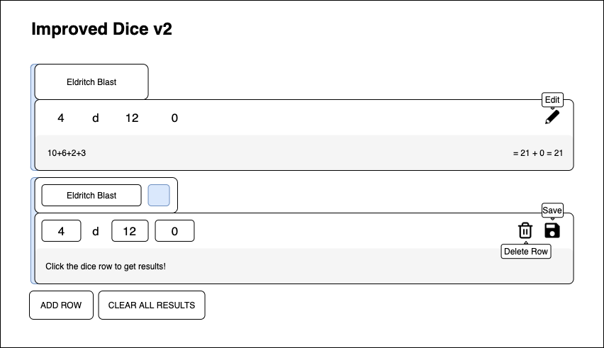

# DnD Dice Roller

This is a small project to get more familiar with React and Redux.

Hopefully it will be useful to someone!

## Features

-  Roll any amount of d4, d6, d8, d10, d12 or d20 dice
-  Apply your modifier to include it in the results
-  Add and remove rows to your liking

## Would like to add

-  Help page to explain how the app works (cleans up unnecessary explanation in 'functional' parts of the app)
-  A tool that helps you rolls for Ability Scores

## Stack

-  React
-  React Router
-  Redux
-  Material UI
-  SASS

## Mockups

A mockup for UX improvements to the dice row:

