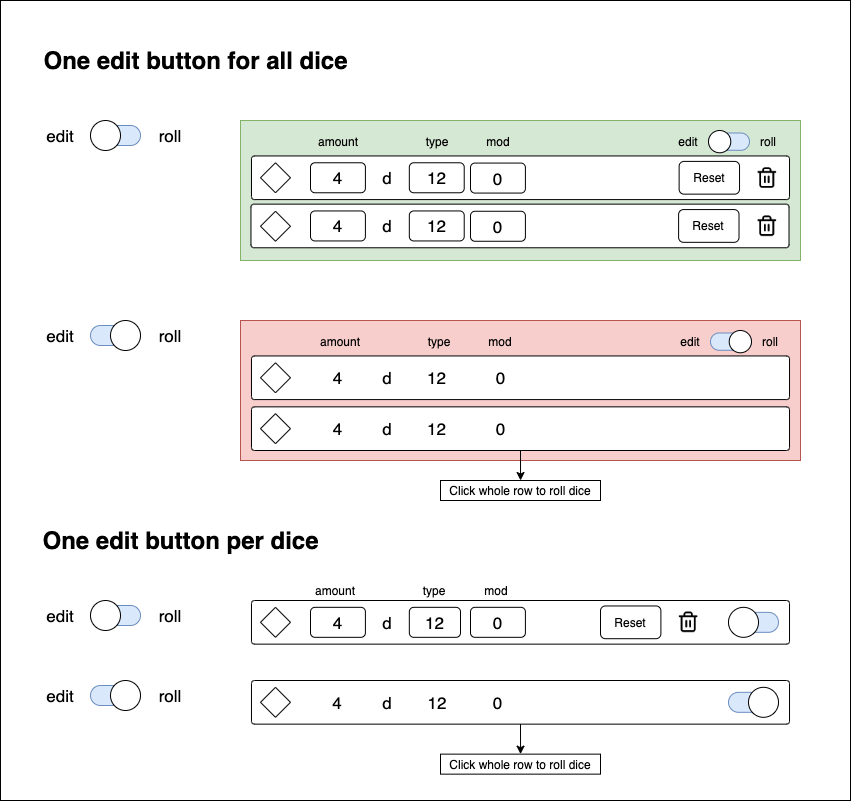

# DnD Dice Roller

This is a small project to get more familiar with React and Redux.

Hopefully it will be useful to someone!

### Features

-  Roll any amount of d4, d6, d8, d10, d12 or d20 dice
-  Apply your modifier to include it in the results
-  Add and remove rows to your liking

### Stack

-  React
-  React Router
-  Redux
-  Material UI
-  SASS

### Mockups

A mockup for UX improvements to the dice row:

